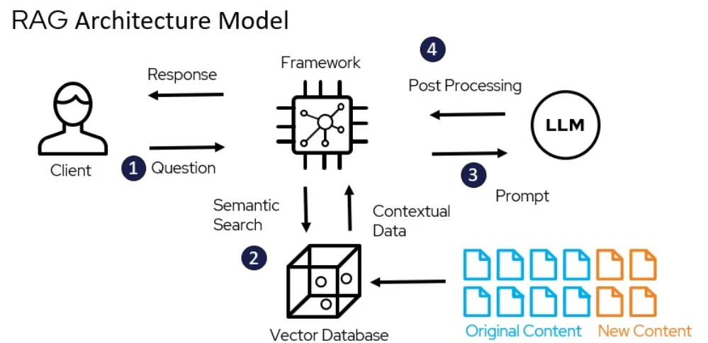

# Langchain Experiment Projects

## Virtual Environment and Dependencies

```shell
$ python3 -m venv env
$ source env/bin/activate
$ pip install -r requirements.txt
```

## Graphviz Intallation for Image Generation (OSx)

```shell
$ brew install graphviz
$ export GRAPHVIZ_DIR="$(brew --prefix graphviz)"
$ pip install pygraphviz --config-settings=--global-option=build_ext --config-settings=--global-option="-I$GRAPHVIZ_DIR/include" --config-settings=--global-option="-L$GRAPHVIZ_DIR/lib"
```

## Chainlit

Chainlit is a simple UI used to make it easy to interact with LLM apps.

To run any of the experiments available, just use Chainlit cli command described in the experiment description section.

## Experiment Descriptions

### Simple Chain

This is the simplest experiment and serves as the starting point to use LangChain. This app does nothing special and is pretty much a private interface to GPT, like ChatGPT.

```shell
$ chainlit run src/simple_chain.py
```

### Simple RAG

#### What is RAG

RAG stands for Retrieval-Augmented Generation and is used to add context to the LLMs making them able to answer questions for information not included in their initial training data.

It works by extracting a set of computational representation from documents, which are an abstraction for data we want to use as context. These vectors must be formatted in a way the LLM model can understand, by referring to it's embeddings settings during the data to vector transformation.

They are them stored and used by LangChain to get improve the LLM prompt with context based on the input provided by the user.



#### The Experiment

This experiment uses in-line document contents to be processed, stored and then retrieved during the conversation which makes the LLM model to answer about a store transaction.

```shell
$ chainlit run src/simple_rag.py
```

#### Example Questions

- How much shirts I sold?
- Who is my best customer?

### Tour de France RAG from Wikipedia

This experiment makes use of a Document Loader, which is way to use external sources as content provider, so we can talk to these contents as context for our queries.

In this case, it uses Wikipedia pages to fetch information about the Tour de France 2023 edition.

```shell
$ chainlit run src/tour_de_france_rag.py
```

#### Example Questions

- Who won the tour?
- Who ended up with the green jersey?

### Titanic Database Chain with Tool

This experiment makes use of a tool to query a database to answer the user's question.

Tools with Chains are really constrained and need to be defined in the expected usage order. Chains doesn't have the ability to use tools only when required, they only have the ability to infer the tool paramters. 
This experiment is just an introduction for custom tools and how to use them with simples Chains.

> I added an extra LLM to the chain to interpret the tool output. This way we can have a better chat message by identifying the data context instead of just returning it directly to the user.

#### Resources

Download the database from [https://github.com/brunogarcia/langchain-titanic-sqlite/blob/main/titanic.db](https://github.com/brunogarcia/langchain-titanic-sqlite/blob/main/titanic.db) and place it in the root folder (not in the src folder)

```shell
$ chainlit run src/titanic_chain_tool.py
```

#### Example Questions
- Jack

### Titanic Agent Tool

> Agents are systems that use an LLM as a reasoning engine to determine which actions to take and what the inputs to those actions should be. The results of those actions can then be fed back into the agent and it determine whether more actions are needed, or whether it is okay to finish.
>
> -- [Langchain Agents Documentation](https://python.langchain.com/v0.2/docs/concepts/#agents)

This experiment aims to use tools in a proper way, by leveraging an LLM agent with the ability to use tools when required and also to interpret it's response.

In the experiment the prompt is defined from a shared prompt repository. The repository is a great resource as it provides valid and well tested prompts for making most of our agents.

The current prompt is quite simple, and you can find it in the [prompt Hub URL](https://smith.langchain.com/hub/hwchase17/openai-tools-agent).

#### Resources

Download the database from [https://github.com/brunogarcia/langchain-titanic-sqlite/blob/main/titanic.db](https://github.com/brunogarcia/langchain-titanic-sqlite/blob/main/titanic.db) and place it in the root folder (not in the src folder)

```shell
$ chainlit run src/titanic_agent_tool.py
```

#### Example Questions
- What can you tell me about Jack?

### LangGraph Experiment

LangGraph is a library used to create agents as graphs (not DAGs, as it allows cyclic flows).
This experiment shows how to rewrite the [Titanic Database Chain with Tool](#titanic-database-chain-with-tool) as a graph.
This looks as deterministic as the other experiment, but next ones will make more use of the features that makes this library so powerful.

```shell
$ chainlit run src/simple_langgraph.py
```

#### Example Questions
- What can you tell me about Jack?